# moto

Motoは、保護猫の取引を管理するためのWebアプリケーションです。このアプリケーションでは、保護猫の画層を位置情報とともにアップロードすることができ、猫のリストを表示したり、猫にいいねをつけたり、取引を完了することができます。このアプリを通して野良猫や行き場のない猫を助けたいです！

## 機能

- ユーザー登録およびログイン
- 猫の一覧表示
- 猫の詳細ページ
- 猫の詳細ページの編集・消去
- マップ検索機能
- 猫へのいいね機能
- 保護猫投稿機能
- 取引完了機能
- メッセージ機能
- いいねしたアイテム・取引したアイテム・マイアイテムの一覧表示

### スクリーンショット
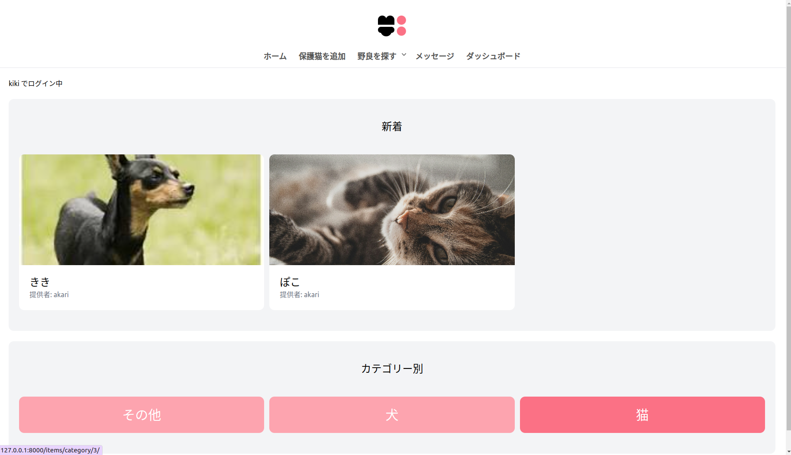
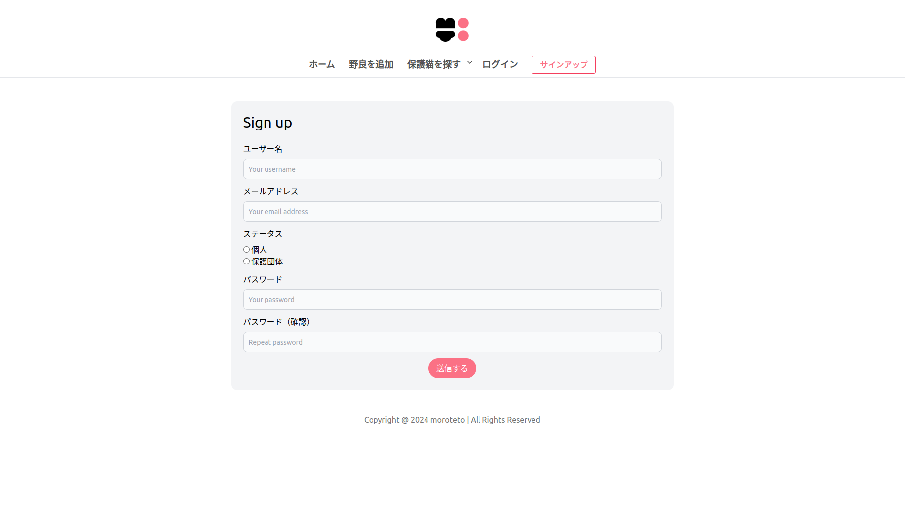
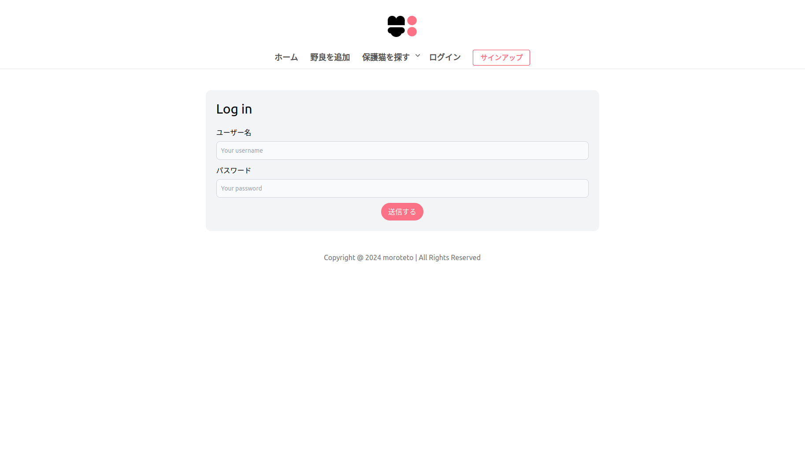
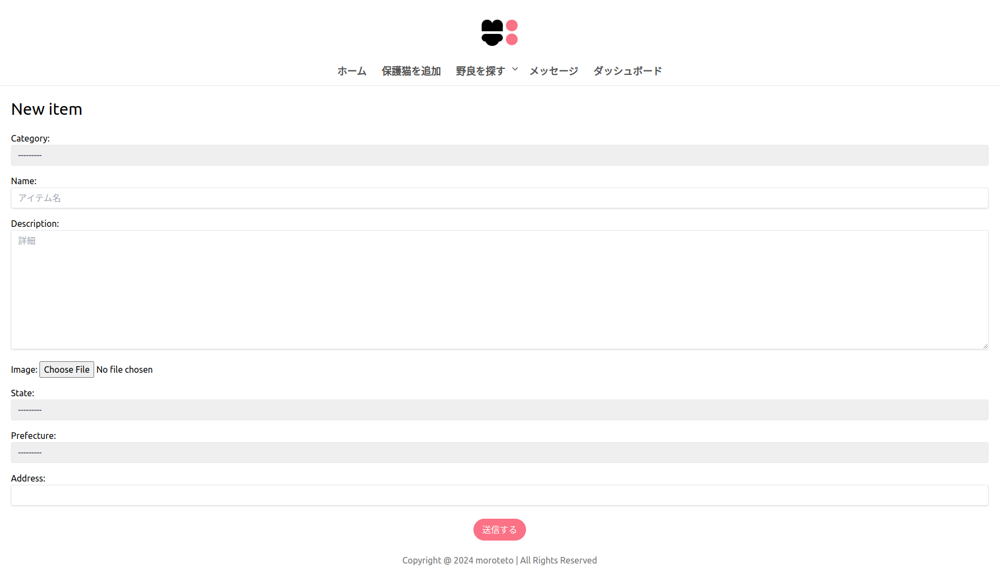
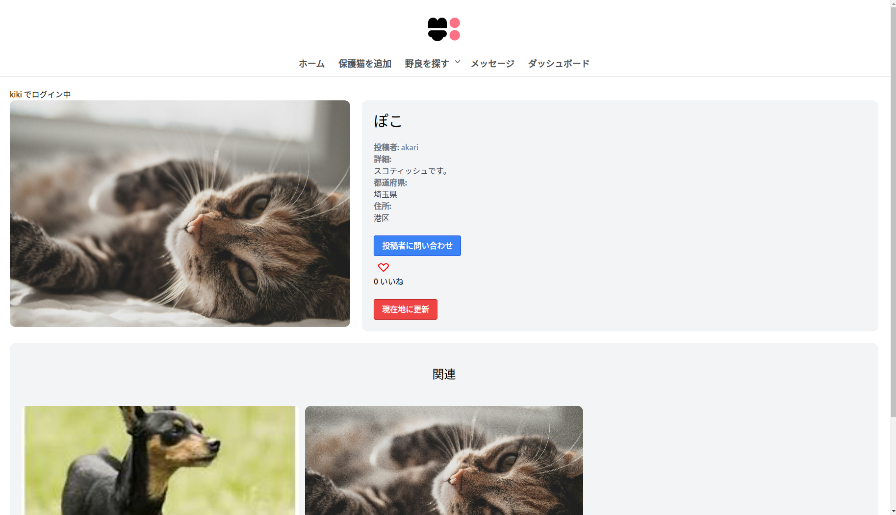
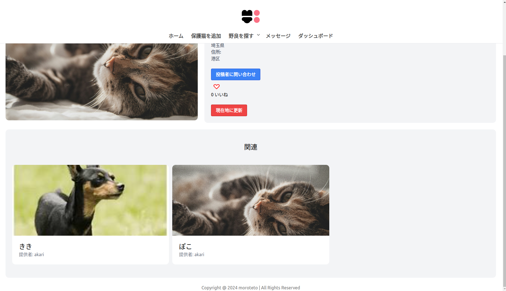
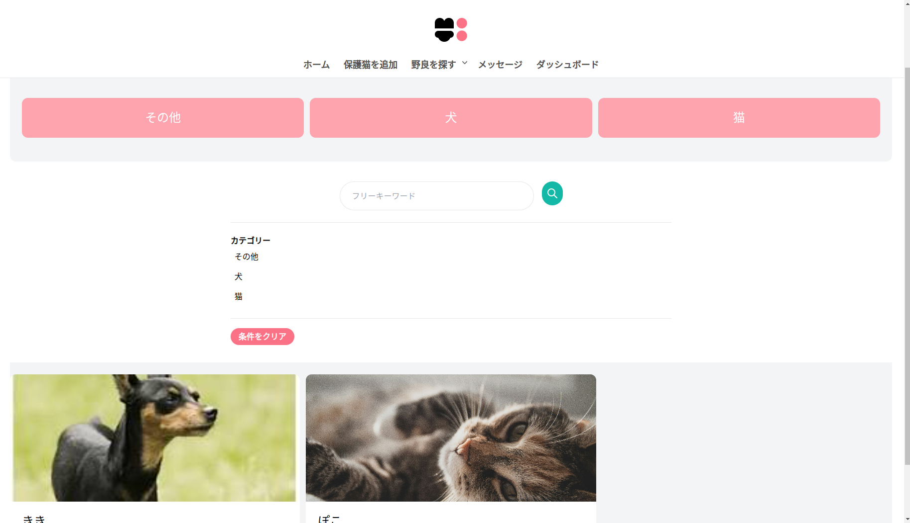
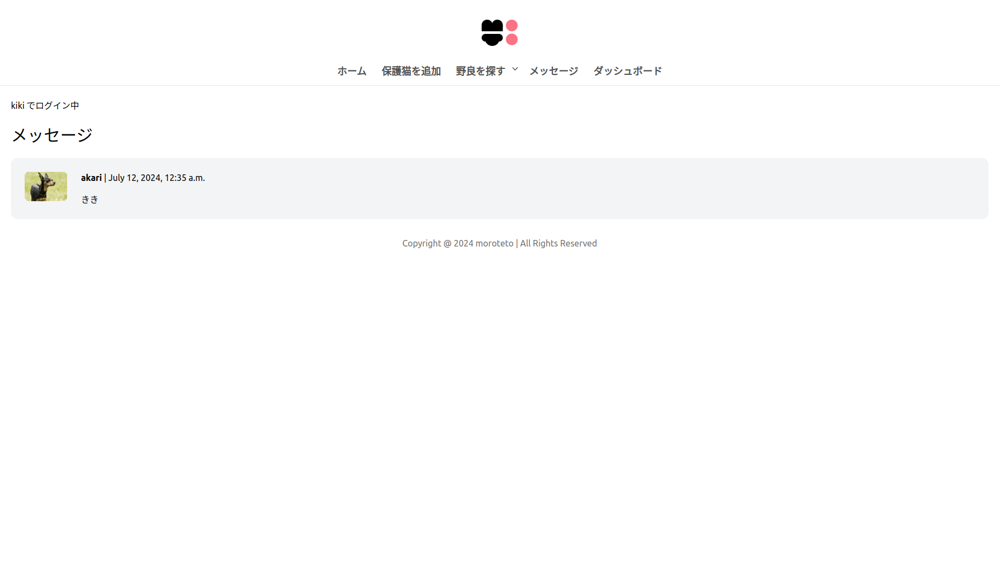
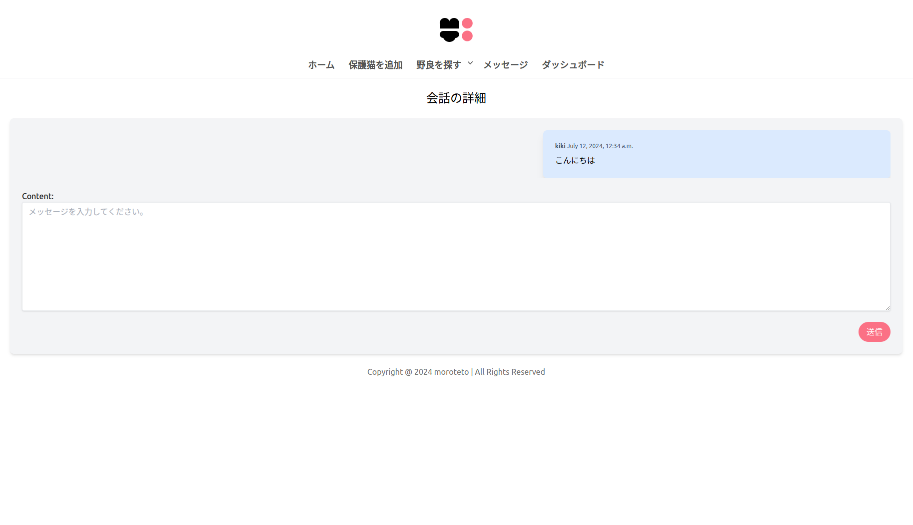
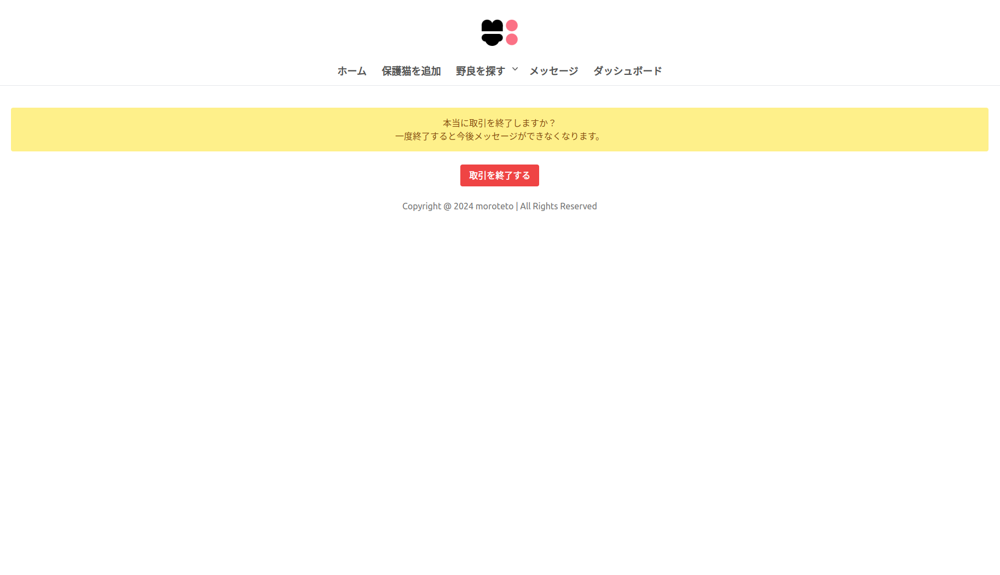
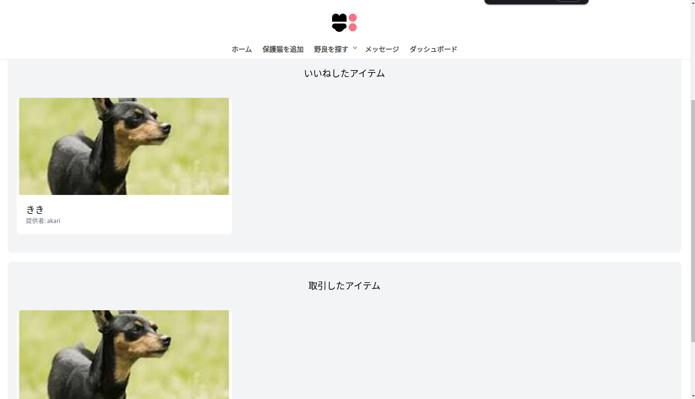

## インストール

このプロジェクトをローカル環境にセットアップする手順は以下の通りです。

### 前提条件

- Python 3.x
- Django

### クローン

まず、リポジトリをクローンします。

git clone https://github.com/kikitetomoro/moto.git

cd moto

###  仮想環境の作成とアクティベート

python -m venv venv

source venv/bin/activate 

# Windowsの場合: venv\Scripts\activate

###   依存関係のインストール

pip install -r requirements.txt

###   データベースのマイグレーション

python manage.py makemigrations

python manage.py migrate

###   サーバーの起動

python manage.py runserver

ブラウザで http://127.0.0.1:8000/ にアクセスしてアプリケーションを確認します。

###   使用方法

- 猫の一覧ページが表示されます。
- トップページからユーザー登録またはログインを行います。
- ログイン後、猫の追加、　メッセージ等をすることができます。
- 猫の詳細ページでいいねを押すことができます。
- 取引ボタンを押して取引を完了することができます。

###   貢献

貢献を希望される方は、Issueを提出するか、プルリクエストを送信してください。大歓迎です！

### ライセンス

Copyright @ 2024 moroteto | All Rights Reserved

###   作者

kikitetomoro
